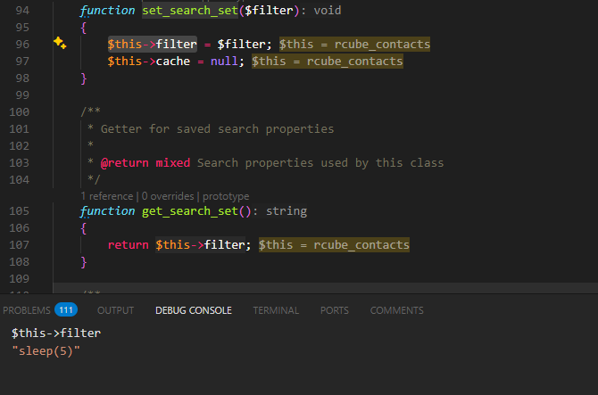
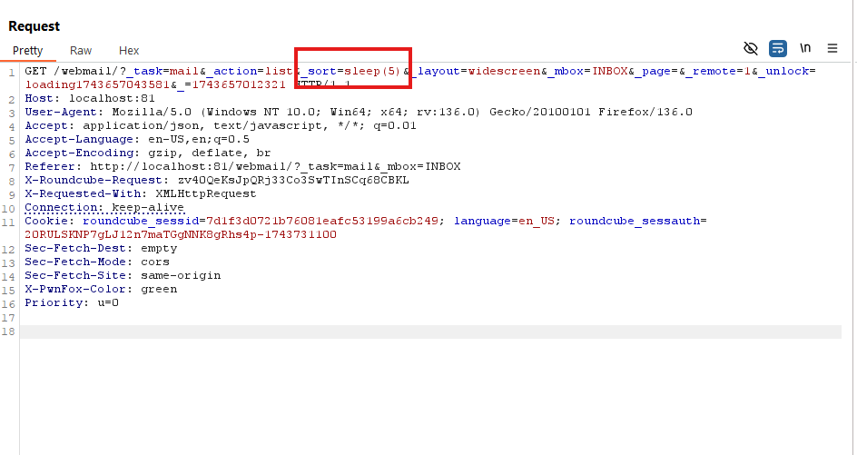

# Phân tích lỗ hổng CVE-2021-44026 (SQL Injection trong Roundcube Webmail)


## Mô tả tổng quan

Lỗ hổng CVE-2021-44026 là một lỗi SQL Injection tồn tại trong Roundcube Webmail, cho phép kẻ tấn công thực thi câu lệnh SQL tùy ý thông qua việc kiểm soát biến ``$_SESSION['search']`` và biến `_sort` trong quá trình export danh bạ. Lỗi phát sinh do hệ thống không phân biệt được session thuộc module mail và addressbook và biến `_sort` không qua bất kì bước kiểm tra nào, dẫn đến việc sử dụng dữ liệu không kiểm soát từ module mail sang module addressbook.

##  Root Cause Analysis

Nguyên nhân của lỗ hổng CVE-2021-44026 nằm ở thiết kế chia sẻ session không đúng cách giữa các module trong ứng dụng RoundCube Webmail:
1. Không phân tích rõ ràng dữ liệu session giữa các module:
    - Biến `$_SESSION['search']` được dùng cho cả module mail và addressbook
    - Trong khi đó, nội dung được gán vào biến `$_SESSION['search']` lại là biến `$_sort` được kiểm soát bởi người dùng khi thao tác với chức năng `list` trong module mail. 

2. Thiếu xác thực nguồn dữ liệu session:
    - Module addressbook sử dụng lại dữ liệu từ `$_SESSION['search']` mà không kiểm tra xem nó đến từ đâu và có hợp lệ hay không.
    - Điều này cho phép kẻ tấn công thao túng nội dung của biến session từ một module và tái sử dụng nó trong module khác với ngữ cảnh hoàn toàn khác.

3. Biến `sort` bị kiểm soát bởi người dùng trong `list.inc` trong module mail của chức năng list :
    - Trong chức năng liệt kê email (list.inc), biến sort có thể bị điều chỉnh bởi người dùng.
    - Sau đó, biến ``$_SESSION['search']`` được gán với giá trị `_sort` mà ta kiểm soát, dẫn đến việc session chứa giá trị không an toàn.
4. Thiếu sử dụng các biện pháp chống SQL Injection:
    - Dữ liệu lấy từ `$_SESSION['search']` được truyền trực tiếp vào truy vấn SQL mà không qua lọc hoặc escape.

## Flow chi tiết của lỗ hổng

### 1. Điểm bắt đầu: `list.inc` trong module mail
Kẻ tấn công có thể inject payload qua tham số `sort` trong action `list` ở file `list.inc`
Sau đó giá trị này được lưu dưới biến `$_SESSION['sort_col']`


`List.inc`
```php
if ($sort = rcube_utils::get_input_value('_sort', rcube_utils::INPUT_GET)) {
    // yes, so set the sort vars
    list($sort_col, $sort_order) = explode('_', $sort);

    // set session vars for sort (so next page and task switch know how to sort)
    if (!in_array('message_sort_col', $dont_override)) {
        $_SESSION['sort_col'] = $save_arr['message_sort_col'] = $sort_col;
    }
    if (!in_array('message_sort_order', $dont_override)) {
        $_SESSION['sort_order'] = $save_arr['message_sort_order'] = $sort_order;
    }
}
```
### 2. Gắn giá trị của `$_SESSION['sort_col']` vào `$_SESSION['search']`
Trong `search.inc` trong module mail, dòng 115, gọi hàm `rcmail_sort_column()` để gán giá trị của `$_SESSION['sort_col']` vào biến `$sort_column`. 


Trong cùng file, dòng 142 gọi hàm `search` có chứa biến `$sort_column`(giá trị được kiểm soát bởi người dùng). 
Trong hàm `search` ở file `rcube_imap.php`, có gọi tới hàm `set_search_set` có chứa payload của kẻ tấn công


```php
    public function search($folder = '', $search = 'ALL', $charset = null, $sort_field = null)
    {
        $this->set_search_set(array($search, $results, $charset, $sort_field, $sorted));

        return $results;
    }
```


Trong cùng file `rcube_imap.php`, hàm `set_search_set` cũng được định nghĩa để lưu trữ thông tin search bao gồm payload của kẻ tấn công


Sau khi lưu xong thì ở file `search.inc` dòng 151, biến `$_SESSION['search']` được định nghĩa để lấy thông tin mà đã được lưu có chứa payload => kiểm soát được biến `$_SESSION['search']`
```php
if ($search_str) {
    $_SESSION['search'] = $RCMAIL->storage->get_search_set();
    $_SESSION['last_text_search'] = $str;
}
```

### 3. Kích hoạt SQL injection qua file `export.inc` ở module mail sử dụng chức năng export

Gắn giá trị 3 vào biến `$_REQUEST['_search']` để chọn index thứ 3 để biến `$search` có giá trị là payload. Sau đó loop qua biến `$search` và dùng hàm `set_search_set($set)` để gán giá trị của biến `$set` vô biến `$filter` trong file `rcube_contacts.php`. Gọi hàm List_records có chứa câu query cũng trong file `rcube_contacts.php`.


```php
if (!empty($_REQUEST['_search']) && isset($_SESSION['search'][$_REQUEST['_search']])) {
    $sort_col = $RCMAIL->config->get('addressbook_sort_col', 'name');
    $search  = (array)$_SESSION['search'][$_REQUEST['_search']];
    $records = array();

    // Get records from all sources
    foreach ($search as $s => $set) {
        $source = $RCMAIL->get_address_book($s);

        // reset page
        $source->set_page(1);
        $source->set_pagesize(99999);
        $source->set_search_set($set);

        // get records
        $result = $source->list_records();

        
}
```




Câu query có chứa biến `$filter` mà chúng ta đã set trước đó . Trigger sql thành công. 


## Steps to Reproduce (POC)

- ### Bước 1: Sử dụng chức năng list của mục options trong phần mail để bắn request. Đổi giá trị của param search




- ### Bước 2: Sử dụng chức năng search ở phần mail để bắn request để giá trị của `$_SESSION['search']` là payload từ `$_SESSION['sort_col']`


- ### Bước 3: Sử dụng chức năng export ở mục contact và thêm param `_search` với giá trị là 3 để kích hoạt payload


## Kết luận
Vấn đề chính nằm ở việc sử dụng `$_SESSION['search']` giữa các module (mail và addressbook) mà không kiểm tra nguồn gốc. Điều này dẫn đến khả năng kiểm soát giá trị truy vấn SQL không an toàn từ bên ngoài. 

## Hậu quả:
- SQL Injection: Kẻ tấn công có thể thao túng truy vấn cơ sở dữ liệu để đánh cắp, sửa đổi hoặc xóa dữ liệu quan trọng
- Session Hijacking: Kẻ tấn công có thể chiếm quyền kiểm soát phiên làm việc, có thể đọc, sửa đổi hoặc xóa email của nạn nhân mà không cần biết mật khẩu gốc
- Social Engineering: Kẻ tấn công có thể giả danh người dùng để gửi email lừa đảo, phát tán mã độc hoặc thực hiện các cuộc tấn công phi kỹ thuật

## Recommendations
- Tách biệt rõ ràng `$_SESSION['search']` cho từng module
- Áp dụng prepared statements để tránh SQL injection
- Xác thực kĩ dữ liệu đầu vào bằng cách thêm các filter

## References

https://pentest-tools.com/blog/roundcube-exfiltrating-emails-with-cve-2021-44026#is-this-vulnerability-still-significant-in-2023
https://github.com/roundcube/roundcubemail/commit/ca5dd51990fef71a0ae32d7be236e5eeee4d322d
https://github.com/roundcube/roundcubemail/commit/c8947ecb762d9e89c2091bda28d49002817263f1
https://github.com/roundcube/roundcubemail/commit/ee809bde2dcaa04857a919397808a7296681dcfa
https://github.com/pentesttoolscom/roundcube-cve-2021-44026